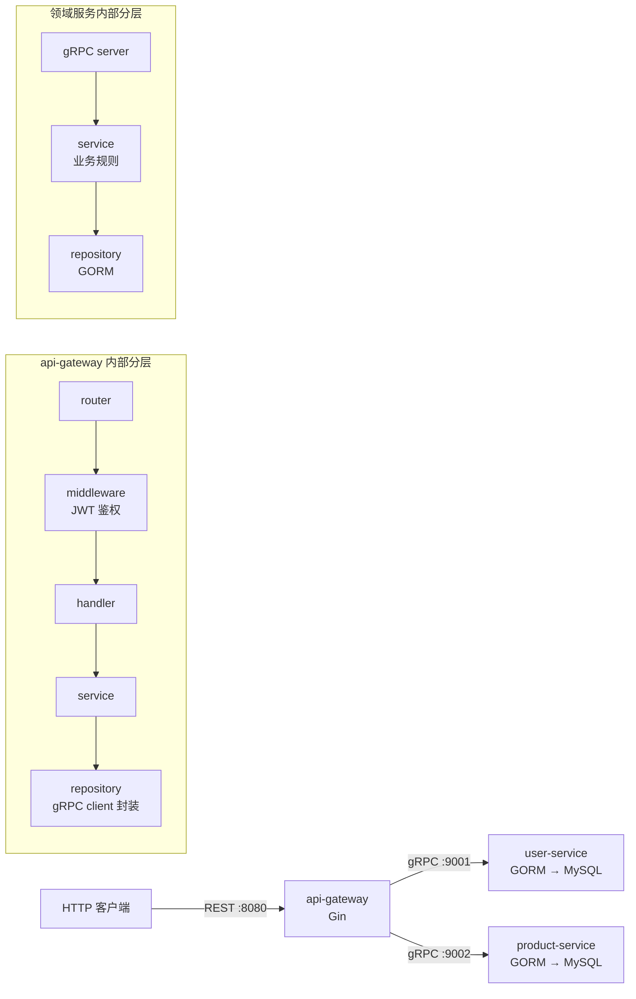

# go-ecom-admin

基于 Go 微服务架构的电商管理后台，包含用户认证与商品管理两大领域。项目采用 **api-gateway + 独立领域服务** 的经典微服务拓扑，网关通过 gRPC 调用下游服务，各服务使用 GORM 访问 MySQL。

## 架构



## 技术栈

| 类别 | 选型 |
|---|---|
| 语言 | Go 1.25 |
| HTTP 框架 | Gin |
| RPC | gRPC + Protobuf |
| ORM | GORM (MySQL) |
| 认证 | JWT (golang-jwt/v5) + bcrypt |
| 配置 | Viper（YAML + 环境变量覆盖） |
| 日志 | zap |
| 单元测试 | testify + mockery（mock）+ glebarez/sqlite（纯 Go 内存库） |

## 目录结构

```
go-ecom-admin/
├── cmd/                        # 组合根：每个服务一个入口
│   ├── api-gateway/            # HTTP 网关 :8080
│   ├── user-service/           # 用户服务 gRPC :9001
│   ├── product-service/        # 商品服务 gRPC :9002
│   └── seed/                   # 数据库 seed 工具
├── configs/config.yaml         # 统一配置（dev 默认值，生产用环境变量覆盖）
├── internal/
│   ├── gateway/                # 网关：router / middleware / handler / service / repository / model
│   ├── user/                   # 用户域：model / repository / service
│   └── product/                # 商品域：model / repository / service
├── pkg/                        # 可复用的基础设施包
│   ├── config/                 # Viper 封装，强类型 Config 结构体
│   ├── logger/                 # zap 封装
│   ├── errors/                 # 应用层错误码（协议无关）
│   └── jwt/                    # JWT 签发与解析
├── proto/                      # .proto 源文件与生成的 pb 代码
└── frontend/                   # 前端（Vite）
```

## 快速开始

```bash
# 1. 准备 MySQL，创建数据库
mysql -uroot -proot -e "CREATE DATABASE IF NOT EXISTS ecom_admin"

# 2. 启动服务（各开一个终端）
go run ./cmd/user-service
go run ./cmd/product-service
go run ./cmd/api-gateway

# 3. （可选）填充测试数据
go run ./cmd/seed
```

调用示例：

```bash
# 注册
curl -X POST http://localhost:8080/api/v1/auth/register \
  -H "Content-Type: application/json" \
  -d '{"username":"alice","email":"alice@example.com","password":"secret123"}'

# 登录（返回 JWT）
curl -X POST http://localhost:8080/api/v1/auth/login \
  -H "Content-Type: application/json" \
  -d '{"username":"alice","password":"secret123"}'

# 携带 JWT 访问商品接口
curl http://localhost:8080/api/v1/products \
  -H "Authorization: Bearer <token>"
```

> 生产环境务必用 `JWT_SECRET` 环境变量覆盖默认 secret（Viper `AutomaticEnv` 已将 `jwt.secret` 映射为 `JWT_SECRET`）。

## 单元测试

```bash
go test ./...                     # 全量测试
go test -cover ./internal/... ./pkg/...   # 带覆盖率
```

测试分层策略：

| 层 | 测试方式 | 覆盖率 |
|---|---|---|
| service | mockery 生成的 MockRepository 注入，只验证业务规则（参数校验、bcrypt、防用户枚举、JWT 签发、AppError → gRPC status 翻译） | user 88.6% / product 74.4% |
| repository | glebarez/sqlite 纯 Go 内存库跑真实 GORM 行为，不依赖外部 MySQL | user 66.7% / product 82.9% |
| pkg/jwt | 覆盖签发/解析/过期/HMAC 白名单等安全边界 | 82.4% |
| pkg/errors | 错误码翻译与边缘分支 | 80.6% |

重新生成 mock（接口变更后）：

```bash
mockery   # 配置见 .mockery.yaml
```

## 设计要点

| 位置 | 设计决策 |
|---|---|
| `gateway/repository/client.go` | Repository 模式的泛化：网关侧 gRPC 客户端统一封装，service 层依赖接口而非具体实现 |
| `product_repository.go` | Update/Delete 用 `RowsAffected == 0` 判存在性：省一次往返查询，且无 TOCTOU 竞态 |
| `user_service.go` | 登录失败统一返回相同错误，防用户枚举攻击（无法探测用户名是否存在） |
| `pkg/errors` | 错误码协议无关 + 边缘翻译；错误分支不向客户端透传 SQL 细节 |
| `pkg/jwt` | Parse 强制 HMAC 算法白名单，防 alg-confusion 攻击 |
| `gateway/model/dto.go` | 反腐层：proto 与对外 DTO 之间的转换（含单位换算）归 gateway，领域服务不感知 HTTP 语义 |
| GORM `TranslateError: true` | 驱动方言错误（如 MySQL 1062 唯一键冲突）统一翻译为 `gorm.ErrDuplicatedKey`，让 repository 层的 `errors.Is` 判定可靠命中，重复注册返回 409 而非 500 |

## 依赖注入与分层约定

- `cmd/*/main.go` 是唯一的组合根：读配置 → 建日志 → 连数据库/拨号 gRPC → 组装依赖链 → 启动服务。
- 各层通过构造函数注入接口依赖（repository 接口在 service 之下定义、由 gRPC client 或 GORM 实现分别落地），`main.go` 只做装配，不含业务逻辑。
