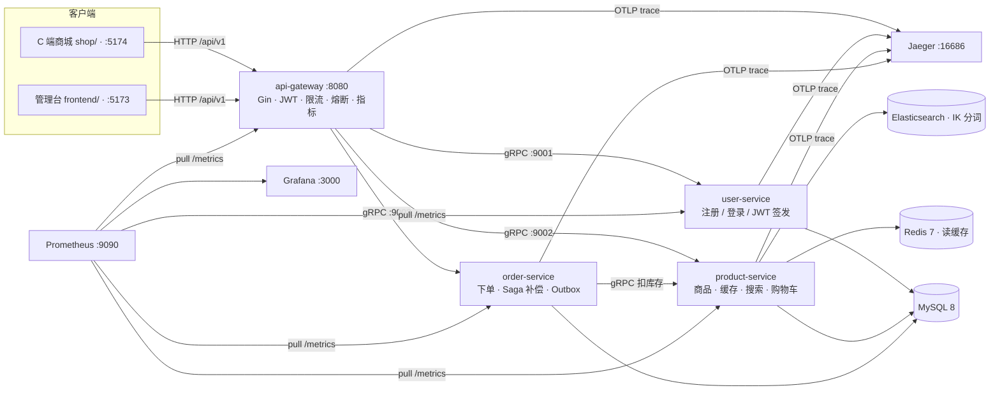

# gosk — Go 全栈电商系统（个人学习项目）

> 由后台管理平台起步、逐步演进为全栈电商项目：  
> API 网关 + 3 个 gRPC 微服务（用户 / 商品 / 订单）+ 管理台与 C 端商城双前端，  
> 覆盖缓存、搜索、分布式事务、限流熔断与全链路可观测性，一条命令即可在本地完整跑起来。


---

## 这个项目是什么

我是一名计算机科学与技术专业的在读本科生，这是我自学 Go 后端过程中的**主线练手项目**（module 名 `go-ecom-admin`）。它不是教程的复刻——从 2026 年 8 月到现在，我按"小步迭代、每步可验证"的方式推进了 70+ 次提交，每个阶段都在解决一个真实的工程问题：

- 单机 CRUD → 拆成网关 + gRPC 微服务
- 能跑 → 跑得稳（健康检查、优雅退出、连接重试、容器自愈）
- 单机可靠 → 分布式可靠（防超卖、Saga 补偿、事务 Outbox、幂等）
- 黑盒 → 可观测（OpenTelemetry 链路追踪 + Prometheus 指标 + Grafana 面板）

开发过程中我综合使用多种 AI 编程助手（Claude Code、ChatGPT、WorkBuddy）并合理分工——让它们分别承担代码生成、方案评审、文档整理等不同角色，我自己做所有设计决策和最终把关：**每一次排障、每一行代码的 why 我都要求自己讲清楚才合并**——仓库里大量注释保留了当时的踩坑记录（比如 docker-compose.yml 里为什么 MySQL 健康检查要用 root 真执行一次 SQL），欢迎翻看。

## 技术亮点

- **防超卖**：条件更新 `UPDATE ... WHERE stock >= ?`，靠 `RowsAffected` 判定成败，不依赖分布式锁
- **分布式事务**：下单扣库存走 Saga 补偿；跨服务事件走事务 Outbox（本地消息表 + relay 投递 + 失败退避重试），消费端幂等
- **缓存**：Repository 接口 + 装饰器模式叠加 Redis 读缓存，写后失效保证一致；TTL 随机抖动防缓存雪崩
- **搜索**：Elasticsearch + IK 中文分词；ES 故障自动降级为 MySQL LIKE，双层超时防止黑洞挂死
- **限流熔断**：网关令牌桶限流（`x/time/rate`）置于 JWT 之前省钱；下游调用熔断（`gobreaker`）
- **可观测性**：OpenTelemetry 全链路 trace（Gin + gRPC + GORM）→ Jaeger；HTTP/gRPC 指标 → Prometheus → Grafana 开箱面板
- **工程化**：多阶段 Dockerfile、`docker compose` 一键环境、kind K8s 部署、Makefile 统一入口、Viper 配置 / zap 日志 / 统一 AppError
- **测试**：核心单测基于 miniredis + SQLite 内存实现，不依赖真实中间件；接口 mock 用 mockery 生成

## 架构


```mermaid
flowchart LR
    subgraph clients["客户端"]
        Shop["C 端商城 shop/ · :5174"]
        Admin["管理台 frontend/ · :5173"]
    end

    Shop & Admin -->|"HTTP /api/v1"| GW["api-gateway :8080<br/>Gin · JWT · 限流 · 熔断 · 指标"]

    GW -->|"gRPC :9001"| US["user-service<br/>注册 / 登录 / JWT 签发"]
    GW -->|"gRPC :9002"| PS["product-service<br/>商品 · 缓存 · 搜索 · 购物车"]
    GW -->|"gRPC :9003"| OS["order-service<br/>下单 · Saga 补偿 · Outbox"]
    OS -->|"gRPC 扣库存"| PS

    US & PS & OS --> DB[("MySQL 8")]
    PS --> Redis[("Redis 7 · 读缓存")]
    PS --> ES[("Elasticsearch · IK 分词")]

    GW & US & PS & OS -->|"OTLP trace"| Jaeger["Jaeger :16686"]
    Prom["Prometheus :9090"] -->|"pull /metrics"| GW & US & PS & OS
    Prom --> Grafana["Grafana :3000"]
```

请求链路示例（下单）：`POST /api/v1/orders` → 网关验 JWT、限流 → order-service 开启本地事务写订单 + Outbox 消息 → gRPC 调 product-service 条件更新扣库存（失败则 Saga 补偿回滚）→ relay 异步投递事件 → 全链路 trace 可在 Jaeger 中查看。

## 快速开始

> 前置：Docker Desktop（含 compose 插件）、可选 make。  
> Windows 没有 make 也能跑——每个 make 目标下面都附了等价的 docker compose 命令。

```bash
# 1. 克隆
git clone https://github.com/sklmz1234/gosk.git
cd gosk

# 2. 准备环境变量（默认值即可本地直跑）
cp .env.example .env

# 3. 一键构建并启动全部服务（MySQL / Redis / ES / 4 个 Go 服务 / 可观测性组件）
make up          # 等价：docker compose up -d --build

# 4. 灌入测试数据（10 个用户 + 20 个商品，密码均为 123456）
make seed        # 等价：docker compose run --rm seed

# 5. 验证
curl http://localhost:8080/healthz        # {"status":"ok"}
curl http://localhost:8080/api/v1/products
```

启动后各入口：

| 入口         | 地址                                                                    | 说明                                  |
| ---------- | --------------------------------------------------------------------- | ----------------------------------- |
| API 网关     | <http://localhost:8080>                                               | `/healthz`、`/metrics`、`/api/v1/...` |
| C 端商城      | `cd shop && npm install && npm run dev` → <http://localhost:5174>     | 浏览商品、搜索、购物车、下单支付全流程                 |
| 商品管理台      | `cd frontend && npm install && npm run dev` → <http://localhost:5173> | 登录后管理商品（seed 账号密码均为 123456）         |
| Jaeger     | <http://localhost:16686>                                              | 查看每次请求的分布式链路                        |
| Grafana    | <http://localhost:3000（admin/admin）>                                  | QPS / P99 / 错误率面板，开箱即用              |
| Prometheus | <http://localhost:9090>                                               | 指标原始查询                              |

常用命令：

```bash
make logs       # 跟踪全部服务日志
make restart    # 只重启 4 个 Go 服务（不动数据）
make down       # 停止（数据卷保留）
make clean      # 停止并清空数据卷（慎用）
make k8s-apply  # 部署到本地 kind 集群（另需 kubectl + kind）
go test ./...   # 单元测试（miniredis/SQLite，无需真实中间件）
```

## 技术栈

**后端**：Go 1.25 · Gin · gRPC + protobuf · GORM · go-redis · go-elasticsearch · Viper · zap · jwt-go · gobreaker · OpenTelemetry · Prometheus client  
**数据与中间件**：MySQL 8 · Redis 7 · Elasticsearch 8（IK 分词）  
**可观测性**：Jaeger · Prometheus · Grafana  
**前端**：React 19 · Vite · antd · zustand  
**测试**：testify · miniredis · SQLite（内存）· mockery  
**部署**：Docker（多阶段构建）· docker-compose · Kubernetes（kind）· Makefile

## 演进历程

- **2026-08** 项目启动：用户 / 商品两个 gRPC 服务 + HTTP 网关 + JWT 鉴权
- **2026-09 上** docker-compose 一键环境 + Makefile；kind K8s 部署（健康检查、优雅退出、镜像滚动更新）
- **2026-09 中** 订单服务：条件更新防超卖、Saga 补偿、事务 Outbox、幂等消费；Redis 读缓存（装饰器模式）；OTel + Prometheus + Grafana 可观测性
- **2026-09 下** Elasticsearch 搜索（IK 分词）+ ES 故障降级 MySQL；商品管理台前端；C 端商城：购物车持久化、结算支付闭环
- **2026-10** 缓存 TTL 随机抖动防雪崩；持续补齐测试与文档

---

如果这个项目能让你看出我的工程习惯和成长轨迹，欢迎通过 GitHub Issue 或邮件与我交流，也欢迎任何 code review 意见——这正是我把代码公开的原因。
